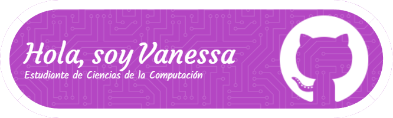

Estudiante de Ciencias de la Computacion | Interes en el analisis de datos y Machine Learning | 🦤 
***
 

## 🔭 Algunos datos sobre mi:
- 🔭 Actualmente estudio Administracion de Empresasa y Ciencias de la Computacion
- 🌱 Estoy iniciando mi aprendizaje en       Analitica de Datos 
- 📫 Contacto: vaosorioa@unal.edu.co/3155376066
- ⚡ Me gusta el anime y salir a caminar

<!--
**vaosorioa/vaosorioa** is a ✨ _special_ ✨ repository because its `README.md` (this file) appears on your GitHub profile.

Here are some ideas to get you started:

- 🔭 I’m currently working on ...
- 🌱 I’m currently learning ...
- 👯 I’m looking to collaborate on ...
- 🤔 I’m looking for help with ...
- 💬 Ask me about ...
- 📫 How to reach me: ...
- 😄 Pronouns: ...
- ⚡ Fun fact: ...
-->
